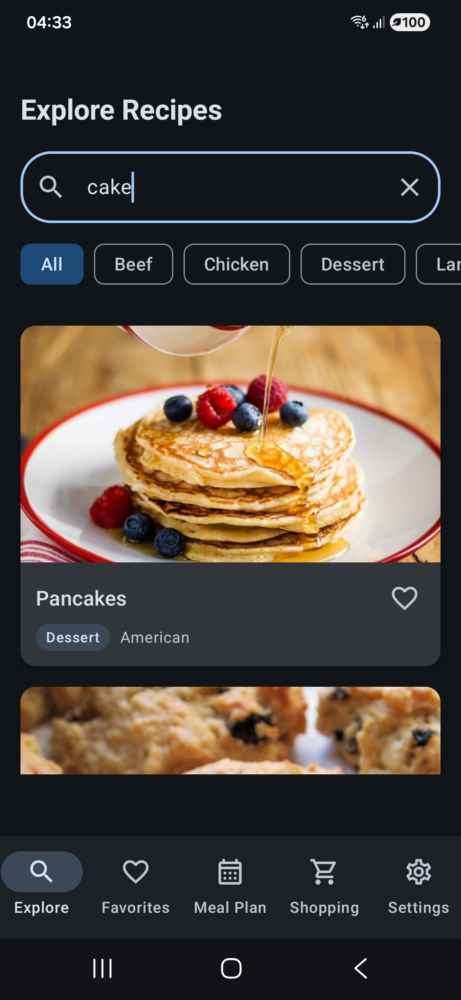
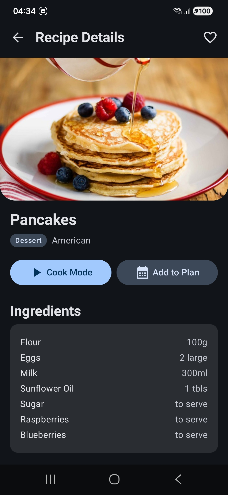
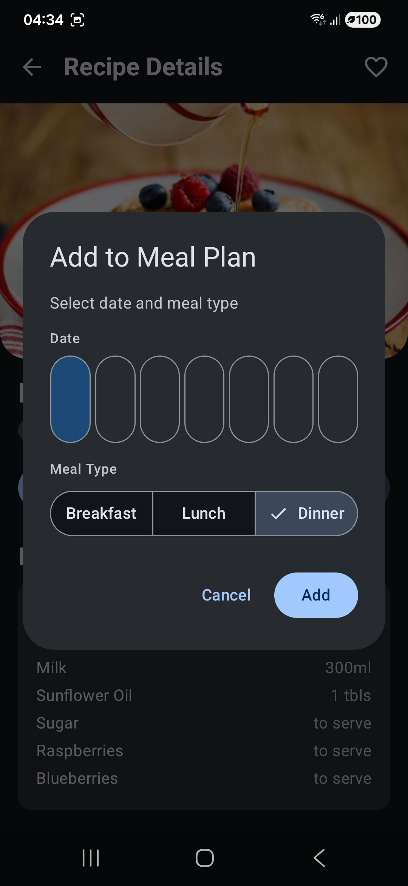
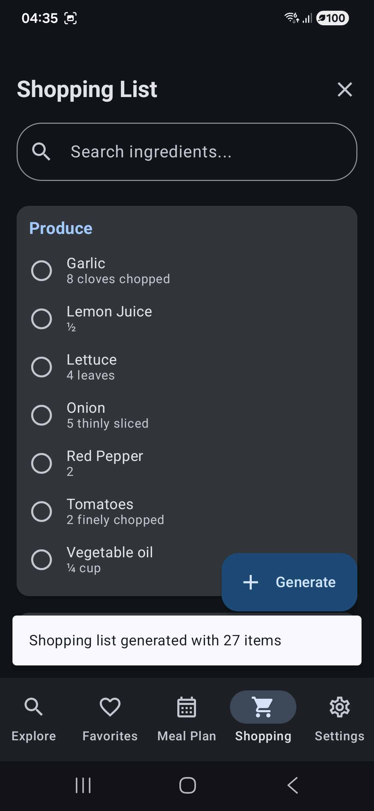
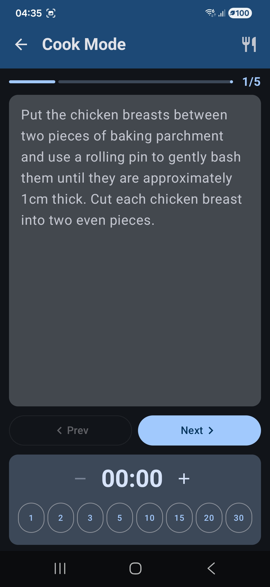
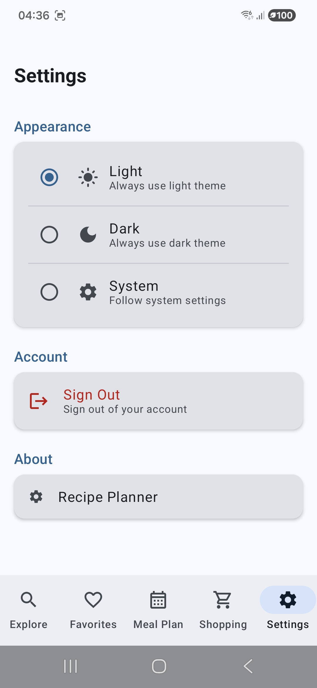

# Recipe Planner

A modern Android application for meal planning, recipe discovery, and shopping list management. Built with Kotlin, Jetpack Compose, and Clean Architecture.


## Features

### Core Features
- **Explore Recipes**: Browse and search recipes from TheMealDB API with category filtering
- **Recipe Details**: View ingredients, instructions, and add to favorites or meal plan
- **My Favorites**: Save recipes for quick access with offline support
- **Meal Plan**: Weekly meal planning with breakfast, lunch, and dinner slots
- **Shopping List**: Auto-generated shopping list from meal plan with smart ingredient grouping
- **Settings**: Light/Dark/System theme support

### Creative Feature: Cook Mode
- **Step-by-step cooking interface** with large, readable text
- **Built-in timer** with quick presets (1, 5, 10 minutes)
- **Swipe navigation** between steps
- **Quick access to ingredients** via bottom sheet

## Architecture

This project follows **Clean Architecture** principles with clear separation of concerns:

```
app/
├── data/                          # Data Layer
│   ├── local/                     # Room Database
│   │   ├── dao/                   # Data Access Objects
│   │   ├── entity/                # Database Entities
│   │   └── RecipePlannerDatabase.kt
│   ├── remote/                    # Network
│   │   ├── api/                   # Retrofit API
│   │   └── dto/                   # Data Transfer Objects
│   ├── mapper/                    # Entity ↔ Domain mappers
│   └── repository/                # Repository Implementations
│
├── domain/                        # Domain Layer
│   ├── model/                     # Domain Models
│   ├── repository/                # Repository Interfaces
│   ├── usecase/                   # Use Cases
│   │   ├── auth/
│   │   ├── favorite/
│   │   ├── mealplan/
│   │   ├── recipe/
│   │   └── shoppinglist/
│   └── util/                      # AppResult
│
├── presentation/                  # Presentation Layer
│   ├── auth/                      # Login/Register
│   ├── explore/                   # Recipe Search
│   ├── details/                   # Recipe Details
│   ├── favorites/                 # Favorites List
│   ├── mealplan/                  # Weekly Meal Plan
│   ├── shoppinglist/              # Shopping List
│   ├── settings/                  # App Settings
│   ├── cookmode/                  # Cook Mode Feature
│   ├── common/                    # UiState
│   ├── components/                # Reusable UI Components
│   ├── navigation/                # Navigation Graph
│   └── theme/                     # Material 3 Theme
│
└── di/                            # Dependency Injection (Hilt)
```

## Tech Stack

| Category | Technology | Version |
|----------|------------|---------|
| Language | Kotlin | 2.0.21 |
| UI Framework | Jetpack Compose + Material 3 | BOM 2024.11.00 |
| Architecture | Clean Architecture + MVVM | - |
| DI | Hilt | 2.52 |
| Local Storage | Room | 2.6.1 |
| Preferences | DataStore | 1.1.1 |
| Networking | Retrofit + OkHttp | 2.11.0 / 4.12.0 |
| Serialization | Kotlinx Serialization | 1.7.3 |
| Backend | Supabase (Auth + PostgreSQL) | 3.0.2 |
| HTTP Client | Ktor | 3.0.1 |
| Image Loading | Coil | 2.7.0 |
| Async | Kotlin Coroutines + Flow | 1.9.0 |
| Testing | JUnit + MockK + Turbine | 4.13.2 / 1.13.13 / 1.2.0 |
| Logging | Timber | 5.0.1 |

## Setup

### Prerequisites
- Android Studio Ladybug or newer
- JDK 17
- Android SDK 35

### Configuration

1. **Clone the repository**
   ```bash
   git clone <repository-url>
   cd Final
   ```

2. **Create Supabase Project**
   - Go to [supabase.com](https://supabase.com) and create a new project
   - Copy your project URL and anon key

3. **Configure local.properties**
   
   Add the following to your `local.properties` file (create if it doesn't exist):
   ```properties
   SUPABASE_URL=https://your-project.supabase.co
   SUPABASE_ANON_KEY=your-anon-key-here
   ```

4. **Set up Supabase Database**
   
   Run the SQL from `supabase/setup.sql` in your Supabase SQL Editor.

5. **Build and Run**
   ```bash
   ./gradlew assembleDebug
   ```

## Supabase Database Setup

See `supabase/setup.sql` for complete database schema including:
- Tables: `favorites`, `meal_plan_entries`, `shopping_list_items`, `profiles`
- Row Level Security (RLS) policies for all tables
- Required indexes for performance
- Auto-create profile trigger on user signup

## API

This app uses [TheMealDB API](https://www.themealdb.com/api.php) which is free and doesn't require an API key for basic usage.

**Endpoints used:**
- `search.php?s={query}` - Search meals by name
- `lookup.php?i={id}` - Get meal details
- `categories.php` - Get all categories
- `filter.php?c={category}` - Filter by category
- `random.php` - Get random meal

## Demo Scenarios

### 1. Authentication Flow
1. Launch app → Auth screen appears
2. Register with email/password
3. Login with credentials
4. Logout from Settings

### 2. Recipe Discovery
1. Browse recipes on Explore tab
2. Use search bar to find specific recipes
3. Filter by category using chips
4. Tap recipe card to view details

### 3. Favorites Management
1. From recipe details, tap heart icon
2. Navigate to Favorites tab to see saved recipes
3. Works offline after initial sync

### 4. Meal Planning
1. From recipe details, tap "Add to Plan"
2. Select date and meal type
3. View weekly plan in Meal Plan tab
4. Navigate between weeks

### 5. Shopping List Generation
1. Add recipes to meal plan
2. Go to Shopping List tab
3. Tap "Generate" button
4. Ingredients are aggregated and categorized
5. Check off items as you shop

### 6. Cook Mode
1. From recipe details, tap "Cook Mode"
2. Navigate through steps with Next/Previous
3. Use timer for timed steps
4. Access ingredients via top-right button

## Project Structure

```
Final/
├── app/
│   ├── src/
│   │   ├── main/
│   │   │   ├── java/com/example/recipeplanner/
│   │   │   ├── res/
│   │   │   └── AndroidManifest.xml
│   │   └── test/                    # Unit Tests
│   └── build.gradle.kts
├── gradle/
│   └── libs.versions.toml           # Version Catalog
├── supabase/
│   └── setup.sql                    # Database Schema
├── screenshots/                     # App Screenshots
├── build.gradle.kts
├── settings.gradle.kts
└── README.md
```

## Testing

Run unit tests:
```bash
./gradlew test
```

Key test files:
- `SignInUseCaseTest.kt` - Auth validation tests
- `ToggleFavoriteUseCaseTest.kt` - Favorite toggle tests
- `GenerateShoppingListUseCaseTest.kt` - Shopping list generation tests

## Code Quality

- Follows Kotlin coding conventions
- KDoc comments on public APIs
- State hoisting in Compose
- Sealed classes for UI states and events
- Flow-based reactive data
- Error handling with AppResult

## Offline Support

The app uses Room as offline cache for:
- ✅ Cached recipes (for previously viewed recipes)
- ✅ Favorites list
- ✅ Meal plan entries
- ✅ Shopping list items

Data syncs with Supabase when online.

## Screenshots

| Explore | Recipe Details | Meal Plan |
|---------|---------------|-----------|
|  |  |  |

| Shopping List | Cook Mode | Settings |
|---------------|-----------|----------|
|  |  |  |

## License

This project is created for educational purposes.

## Author

Final project for Android Development course.
